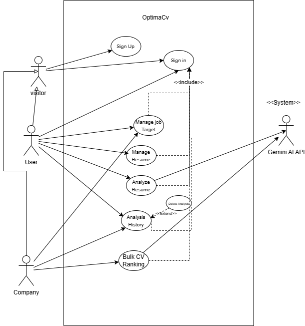
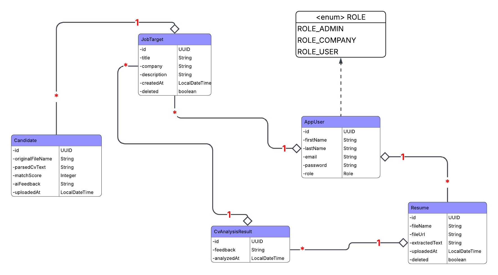
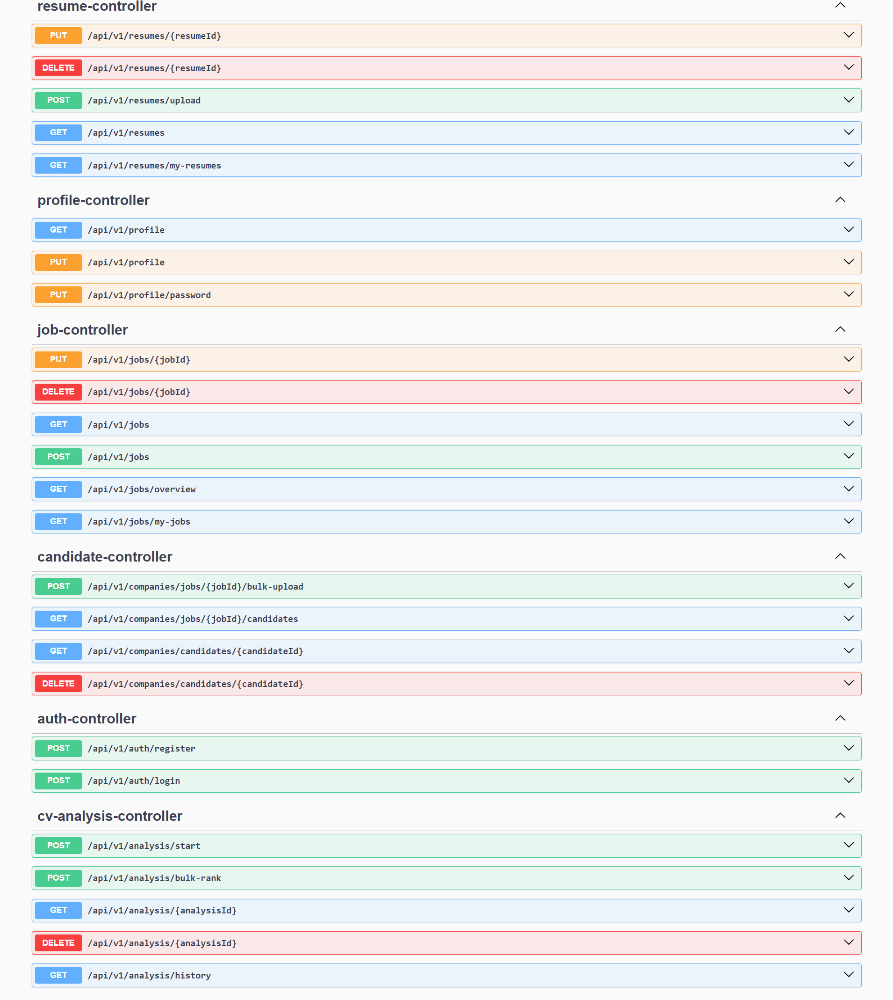

<div align="center">
  <h1>🚀 OptimaCV</h1>
  <p><strong>AI-powered CV Analyzer perfectly designed for smart recruitment.</strong></p>

  <!-- Badges -->
  <p>
    
    
    
    
  </p>
</div>

---

## 📖 About The Project

**OptimaCV** is a full-stack, AI-driven platform designed to seamlessly analyze incoming CVs and evaluate their fit against specific Job Targets. By leveraging generative AI models and an intelligent modular backend, OptimaCV provides recruiters with precise candidate matching, dynamically tailored interview guides, and a streamlined talent analysis history.

## ✨ Key Features

- **🧠 Intelligent CV Analysis**: Extracts and analyzes text from PDFs, evaluating them against target job descriptions via Google GenAI.
- **🏗️ Domain-Driven Modulith**: Strict, clean boundaries managed by Spring Modulith to ensure modularity without the architectural tax of microservices.
- **⚡ Reactive & Modern UI**: A blazing-fast Angular 21 frontend utilizing NgRx Signals for lightweight, reactive state management.
- **🎨 Beautiful & Responsive UI**: Built with Tailwind CSS v4 and DaisyUI v5 for an accessible, visually stunning, and highly interactive experience.
- **🔒 Secure Access**: JWT-based Spring Security implementation to protect recruiter data and CV analyses.
- **🐋 DevOps Ready**: Fully containerized multi-container setup for effortless local development and deployment.

---

## 🛠️ Tech Stack

### Back-End
- **Framework**: Spring Boot `v4.0.3`
- **Architecture**: Spring Modulith `v2.0.3`
- **Language**: Java 17
- **AI Integration**: Spring AI (Google GenAI `v2.0.0-M2`)
- **Document Processing**: Spring AI PDF Document Reader (Apache PDFBox)
- **Database**: PostgreSQL
- **Security**: Spring Security + JWT (`jjwt v0.11.5`)
- **Mapping**: MapStruct `v1.6.0`

### Front-End
- **Framework**: Angular `v21.2.0`
- **State Management**: NgRx Signals (`@ngrx/signals v21.0.1`)
- **CSS Framework**: Tailwind CSS `v4.2.1`
- **Component Library**: DaisyUI `v5.5.19`
- **Icons & Toasts**: Lucide Angular & Ngx-Sonner
- **Animations**: Lottie Web (`ngx-lottie`)

---

## 🏛️ Architecture & Modeling

The project employs a clear separation of concerns using domain-driven design principles thoughtfully adapted for a Spring Modulith. 

### Use Case Diagram


### Class Diagram


---

## 📚 API Documentation

The Back-End exposes a comprehensive RESTful API, fully documented and easily testable via OpenAPI/Swagger.



*When the back-end is running locally, access the Swagger UI directly at `http://localhost:8080/swagger-ui.html`*

---

## 🚀 Getting Started

To run the full stack (Back-End, Front-End, and Database) locally, ensure you have Docker and Docker Compose installed.

### Prerequisites
- Docker & Docker Compose
- Java 17+ (If running backend natively)
- Node.js & npm (If running frontend natively)

### Execution using Docker Compose
The easiest way to get everything up and running:

```bash
# Clone the repository
git clone https://github.com/chehachraf/optimacv.git
cd optimacv

# Spin up the containers in detached mode
docker-compose up --build -d
```

Once the containers are successfully running:
- **Front-End Application**: http://localhost:4200
- **Back-End API Base**: http://localhost:8080
- **Swagger Documentation**: http://localhost:8080/swagger-ui.html

To stop the services and remove containers, simply run:
```bash
docker-compose down
```
